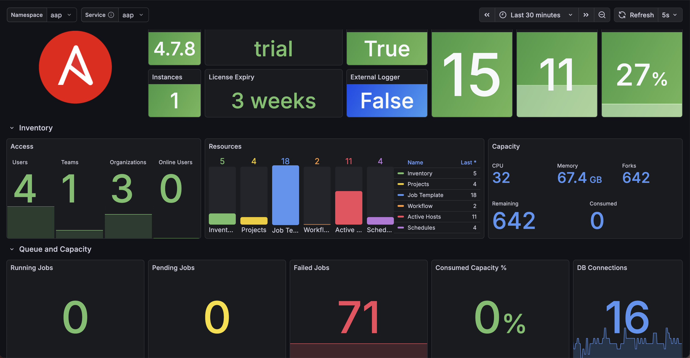
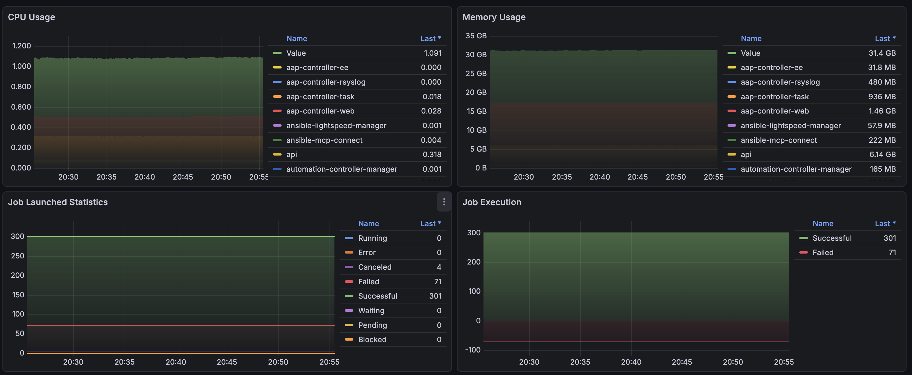
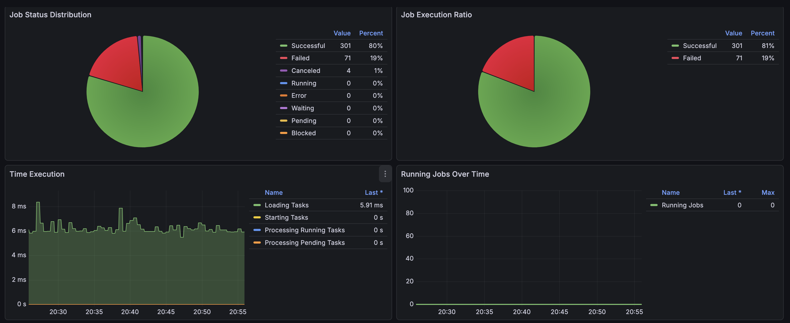
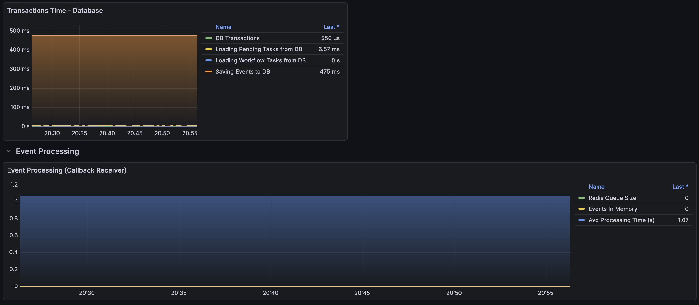

# **Monitoring Ansible Automation Platform using User-Defined Projects and Grafana**

&nbsp;

> This article is based on the amazing article and dashboard of **Leonardo Araujo**, adjusted to match Ansible Automation Platform 2.5+ and with additional metrics added.
>
> Original repositories reside here:
> - [Article](https://github.com/leoaaraujo/articles/blob/master/aap-openshift-monitoring/ARTICLE.md)
> - [Dashboard](https://github.com/leoaaraujo/aap-dashboard)

&nbsp;

> ### In this article, we will demonstrate how to monitor Ansible Automation Platform (AAP) running on OpenShift, using user-workload-monitoring with Prometheus and Grafana.
>
> In this article we use the following versions:
> - OpenShift v4.16+
> - Grafana Operator v5.21
> - Ansible Automation Platform v2.5+


&nbsp;

| :exclamation:  Installation of the Ansible Automation Platform will not be covered. |
|------------------------------------------|


&nbsp;

## Table of Contents

- [About](#about)
- [Repository Structure](#repository-structure)
- [Prerequisites](#prerequisites)
- [Procedure](#procedure)
  - [Enable user-defined projects](#enable-user-defined-projects)
  - [Install Grafana Operator](#install-grafana-operator)
  - [Creating User in Ansible Automation Platform](#creating-user-in-ansible-automation-platform)
  - [Creating Prometheus ServiceMonitor](#creating-prometheus-servicemonitor)
  - [Creating Grafana Dashboard](#creating-grafana-dashboard)
- [Viewing the Dashboard](#viewing-the-dashboard)
- [Kustomize Deployment (Alternative)](#kustomize-deployment-alternative)
- [Conclusion](#conclusion)
- [References](#references)

&nbsp;

## **About**

- This article is aimed at users who need to have a more centralized view of the main usage metrics of the Ansible Automation Platform and simply identify possible situations of concern.
- In this article, we will cover resources such as Grafana, datasources and dashboards, Prometheus and ServiceMonitors to collect data dynamically.
- A Kustomize-based deployment structure is provided for reproducible, GitOps-friendly installation.


## **Repository Structure**

```
aap-monitoring/
├── common/base/
│   ├── auth/              # Service account token secret
│   ├── core/              # Grafana instance, datasource, session secret, certs, folder
│   ├── dashboards/        # AAP Grafana dashboard
│   ├── rbac/              # Namespace, ClusterRoles, RoleBindings
│   └── servicemonitor/    # AAP ServiceMonitor for Prometheus metrics scraping
└── overlays/aap-grafana/
    ├── dashboards/        # Deploys auth + dashboards with namespace override
    ├── grafana-instance/  # Deploys core with user role and datasource patches
    ├── infrastructure-rbac/  # Deploys RBAC with namespace patches
    └── servicemonitor/    # Deploys ServiceMonitor for AAP metrics
```


## **Prerequisites**

- User with the cluster-admin cluster role
- OpenShift 4.16+
- Grafana Operator v5.21+
- User-Defined Projects enabled


## **Procedure**


### **Enable user-defined projects**

- Execute this command to add `enableUserWorkload: true` under `data/config.yaml`

```shell
oc -n openshift-monitoring patch configmap cluster-monitoring-config -p '{"data":{"config.yaml":"enableUserWorkload: true"}}'
```

&nbsp;

- Validate that the **prometheus** and **thanos-ruler** pods were created in the **openshift-user-workload-monitoring** project

```shell
oc get pods -n openshift-user-workload-monitoring
NAME                                                   READY   STATUS    RESTARTS   AGE
grafana-deployment-6847648746-4mbn9                    1/1     Running   0          95m
grafana-operator-controller-manager-7f74d54f44-58pwk   1/1     Running   0          6h55m
prometheus-operator-cf59f9bdc-t7nvm                    2/2     Running   0          7h6m
prometheus-user-workload-0                             6/6     Running   0          7h6m
prometheus-user-workload-1                             6/6     Running   0          7h6m
thanos-ruler-user-workload-0                           4/4     Running   0          7h6m
thanos-ruler-user-workload-1                           4/4     Running   0          7h6m
```

&nbsp;

### **Install Grafana Operator**

- Using the **WebConsole**, in the left side menu, select **OperatorHub** and then in the search field, search for **Grafana Operator**.
- Make sure to change the project context to **openshift-user-workload-monitoring** at the top.
- Click on the operator, click on **Install**.


&nbsp;

- In **Update Channel**, select **v5**
- In **Installation Mode**, select **A specific namespace on the cluster** and choose **openshift-user-workload-monitoring** below.
- In **Update approval**, select **Automatic**
- Click **Install**.


&nbsp;

- Now let's set up the RBAC and secrets required for the Grafana instance. The Grafana Operator will automatically create a `grafana-sa` service account. We need to grant it permissions for OAuth authentication and metrics access.

> **Note:** Instead of using a username/password, we use the OpenShift OAuth proxy to authenticate users with their existing OpenShift credentials.

```shell
oc project openshift-user-workload-monitoring
```

- Create the RBAC resources for OAuth proxy authentication:

```shell
cat <<EOF | oc apply -f -
---
apiVersion: rbac.authorization.k8s.io/v1
kind: ClusterRole
metadata:
  name: grafana-proxy
rules:
  - verbs:
      - create
    apiGroups:
      - authentication.k8s.io
    resources:
      - tokenreviews
  - verbs:
      - create
    apiGroups:
      - authorization.k8s.io
    resources:
      - subjectaccessreviews
---
apiVersion: rbac.authorization.k8s.io/v1
kind: RoleBinding
metadata:
  name: grafana-proxy
  namespace: openshift-user-workload-monitoring
roleRef:
  apiGroup: rbac.authorization.k8s.io
  kind: ClusterRole
  name: grafana-proxy
subjects:
  - kind: ServiceAccount
    name: grafana-sa
    namespace: openshift-user-workload-monitoring
---
apiVersion: rbac.authorization.k8s.io/v1
kind: ClusterRoleBinding
metadata:
  name: grafana-auth-delegator
roleRef:
  apiGroup: rbac.authorization.k8s.io
  kind: ClusterRole
  name: system:auth-delegator
subjects:
  - kind: ServiceAccount
    name: grafana-sa
    namespace: openshift-user-workload-monitoring
---
apiVersion: rbac.authorization.k8s.io/v1
kind: ClusterRoleBinding
metadata:
  name: grafana-cluster-monitoring-view
roleRef:
  apiGroup: rbac.authorization.k8s.io
  kind: ClusterRole
  name: cluster-monitoring-view
subjects:
  - kind: ServiceAccount
    name: grafana-sa
    namespace: openshift-user-workload-monitoring
EOF
```

- Create the session secret for the OAuth proxy and the service account token secret for Prometheus access:

```shell
cat <<EOF | oc apply -f -
---
apiVersion: v1
kind: Secret
metadata:
  name: grafana-proxy
  namespace: openshift-user-workload-monitoring
data:
  session_secret: $(openssl rand -base64 43 | base64 -w 0)
type: Opaque
---
apiVersion: v1
kind: Secret
metadata:
  name: grafana-auth-secret
  namespace: openshift-user-workload-monitoring
  annotations:
    kubernetes.io/service-account.name: grafana-sa
type: kubernetes.io/service-account-token
EOF
```
&nbsp;

- Now let's create our Grafana instance with an OpenShift OAuth proxy sidecar. This enables authentication using existing OpenShift credentials instead of a separate username/password. The Route and Service with TLS are defined directly in the Grafana CR.

```shell
cat <<EOF > grafana-instance.yaml
apiVersion: grafana.integreatly.org/v1beta1
kind: Grafana
metadata:
  name: grafana
  labels:
    dashboards: "grafana"
spec:
  serviceAccount:
    metadata:
      annotations:
        serviceaccounts.openshift.io/oauth-redirectreference.primary: '{"kind":"OAuthRedirectReference","apiVersion":"v1","reference":{"kind":"Route","name":"grafana-route"}}'
  route:
    spec:
      port:
        targetPort: https
      tls:
        termination: reencrypt
      to:
        kind: Service
        name: grafana-service
        weight: 100
      wildcardPolicy: None
  deployment:
    spec:
      template:
        spec:
          volumes:
            - name: grafana-tls
              secret:
                secretName: grafana-tls
            - name: grafana-proxy
              secret:
                secretName: grafana-proxy
            - name: ocp-injected-certs
              configMap:
                name: ocp-injected-certs
          containers:
            - name: grafana-proxy
              image: "quay.io/openshift/origin-oauth-proxy"
              args:
                - "-provider=openshift"
                - "-pass-basic-auth=false"
                - "-https-address=:9091"
                - "-http-address="
                - "-email-domain=*"
                - "-upstream=http://localhost:3000"
                - '-openshift-sar={"resource": "namespaces", "verb": "get"}'
                - '-openshift-delegate-urls={"/": {"resource": "namespaces", "verb": "get"}}'
                - "-tls-cert=/etc/tls/private/tls.crt"
                - "-tls-key=/etc/tls/private/tls.key"
                - "-client-secret-file=/var/run/secrets/kubernetes.io/serviceaccount/token"
                - "-cookie-secret-file=/etc/proxy/secrets/session_secret"
                - "-openshift-service-account=grafana-sa"
                - "-openshift-ca=/etc/pki/tls/cert.pem"
                - "-openshift-ca=/var/run/secrets/kubernetes.io/serviceaccount/ca.crt"
                - "-openshift-ca=/etc/proxy/certs/ca-bundle.crt"
                - "-skip-auth-regex=^/metrics"
              ports:
                - containerPort: 9091
                  name: https
              resources:
                requests:
                  cpu: 100m
                  memory: 128Mi
                limits:
                  cpu: 500m
                  memory: 256Mi
              volumeMounts:
                - mountPath: /etc/tls/private
                  name: grafana-tls
                  readOnly: true
                - mountPath: /etc/proxy/secrets
                  name: grafana-proxy
                  readOnly: true
                - mountPath: /etc/proxy/certs
                  name: ocp-injected-certs
                  readOnly: true
  service:
    metadata:
      annotations:
        service.beta.openshift.io/serving-cert-secret-name: grafana-tls
    spec:
      ports:
        - name: https
          port: 9091
          protocol: TCP
          targetPort: https
  client:
    preferIngress: false
  config:
    log:
      mode: "console"
    auth.anonymous:
      enabled: "True"
    auth:
      disable_login_form: "False"
      disable_signout_menu: "True"
    auth.basic:
      enabled: "True"
    auth.proxy:
      enabled: "True"
      enable_login_token: "True"
      header_property: "username"
      header_name: "X-Forwarded-User"
      auto_assign_org_role: "Admin"
    users:
      auto_assign_org_role: "Admin"
EOF
```

- Create the ConfigMap for CA certificates injection:

```shell
cat <<EOF | oc apply -f -
apiVersion: v1
kind: ConfigMap
metadata:
  name: ocp-injected-certs
  namespace: openshift-user-workload-monitoring
  labels:
    config.openshift.io/inject-trusted-cabundle: "true"
EOF
```

&nbsp;

- Let's apply and validate our created Instance:

```shell
oc -n openshift-user-workload-monitoring create -f grafana-instance.yaml

oc -n openshift-user-workload-monitoring get pods -l app=grafana
```

&nbsp;

- The Route is created automatically by the Grafana CR. Display it with:

```shell
oc -n openshift-user-workload-monitoring get route grafana-route -o jsonpath='{.spec.host}'
```
&nbsp;

- Let's create our **Grafana Datasource**, which will connect to **thanos-querier** in the **openshift-monitoring** project and will use the **grafana-sa** serviceaccount token stored in the `grafana-auth-secret`.

```shell
cat <<EOF > grafana-datasource.yaml
apiVersion: grafana.integreatly.org/v1beta1
kind: GrafanaDatasource
metadata:
  name: grafana-ds
  namespace: openshift-user-workload-monitoring
spec:
  valuesFrom:
    - targetPath: "secureJsonData.httpHeaderValue1"
      valueFrom:
        secretKeyRef:
          name: "grafana-auth-secret"
          key: "token"
  instanceSelector:
    matchLabels:
      dashboards: "grafana"
  datasource:
    name: Prometheus
    type: prometheus
    access: proxy
    url: https://thanos-querier.openshift-monitoring.svc:9091
    isDefault: true
    jsonData:
      "tlsSkipVerify": true
      "timeInterval": "5s"
      httpHeaderName1: "Authorization"
    secureJsonData:
      "httpHeaderValue1": "Bearer \${token}"
    editable: true
EOF
```

&nbsp;

- Let's apply and validate our created Datasource

```shell
oc -n openshift-user-workload-monitoring create -f grafana-datasource.yaml

oc -n openshift-user-workload-monitoring get GrafanaDatasource
NAME         NO MATCHING INSTANCES   LAST RESYNC   AGE
grafana-ds                           119s          3d23h
```


&nbsp;

- To validate our created datasource using Grafana Console, access the route URL via browser. You will be redirected to the OpenShift login page — authenticate using your OpenShift credentials.
- Once authenticated, click **Configuration** > **Data sources**


&nbsp;

### **Creating User in Ansible Automation Platform**

- Access the AAP console and let's create a user for our monitoring.
- To do this, in the left side menu, click on **Users** > **Add**


&nbsp;

- To generate the token, authenticate to AAP using the created user and then click on Users > click on the name of the created user > **Token** > **Add**
- Define a **description** and **scope** as **read** and click **Save**, then a popup will be displayed with the token, copy and save.


&nbsp;

### **Creating Prometheus ServiceMonitor**

- Let's create a **ServiceMonitor** to collect metrics from our **AAP** and export through our **Prometheus** and **Thanos Querier**.
- First, let's create a secret to store our bearer token, previously collected in **AAP** with the user **aap-metrics**.

```shell
oc create secret generic aap-monitor-creds --from-literal=token={{ YOUR AAP BEARER TOKEN }} -n aap
```
&nbsp;

- Now let's create **ServiceMonitor**, which will discover the AAP gateway service and collect the metrics that are in the path **/api/controller/v2/metrics/**.

> **Note:** In AAP 2.5+, the metrics endpoint moved from `/api/v2/metrics/` to `/api/controller/v2/metrics/` and authentication goes through the platform gateway.

```shell
cat <<EOF > svc-monitor-aap.yaml
apiVersion: monitoring.coreos.com/v1
kind: ServiceMonitor
metadata:
  name: aap-monitor
  namespace: aap
spec:
  endpoints:
  - interval: 30s
    scrapeTimeout: 10s
    honor_labels: true
    path: /api/controller/v2/metrics/
    port: http
    scheme: http
    bearerTokenSecret:
      key: token
      name: aap-monitor-creds
  namespaceSelector:
    matchNames:
    - aap
  selector:
    matchLabels:
      app.kubernetes.io/component: aap
EOF
```

&nbsp;

- Now let's apply and validate our created ServiceMonitor

```shell
oc create -f svc-monitor-aap.yaml

oc get servicemonitor -n aap
NAME          AGE
aap-monitor   31m
```

&nbsp;

- To validate using the **WebConsole**, in the left side menu, click on **Targets** in the **Observe** Session, in Filter select **User**.


&nbsp;

- Still in the **Observe** section, click on **Metrics**, we will identify whether the AAP metrics are arriving correctly, use any metric starting with **awx_**, for example **awx_instance_info**


&nbsp;

### **Creating Grafana Dashboard**

- Now let's apply the AAP Grafana dashboard. The dashboard YAML file with the full JSON embedded is available at `common/base/dashboards/grafana-aap-dashboard.yaml`.

```shell
oc -n openshift-user-workload-monitoring apply -f common/base/dashboards/grafana-aap-dashboard.yaml
```

- Validate our created GrafanaDashboard:

```shell
oc -n openshift-user-workload-monitoring get grafanadashboard
NAME                    NO MATCHING INSTANCES   LAST RESYNC   AGE
grafana-dashboard-aap                           3s            145m
```

&nbsp;

### **Viewing the Dashboard**

- Access Grafana, in the left side menu, click on **Dashboards** and then on **Browse**
- A folder with the name **AAP Dashboards** and the dashboard **AAP - Metrics v3** will be displayed, click on the dashboard.


&nbsp;

- Dashboard


&nbsp;

&nbsp;

&nbsp;


&nbsp;

### **Kustomize Deployment (Alternative)**

If you prefer a GitOps-friendly approach, you can deploy all resources using the Kustomize overlays. Deploy in this order:

```shell
# 1. RBAC and namespace
oc apply -k overlays/aap-grafana/infrastructure-rbac/

# 2. Grafana instance, datasource, and supporting resources
oc apply -k overlays/aap-grafana/grafana-instance/

# 3. ServiceMonitor for AAP metrics
oc apply -k overlays/aap-grafana/servicemonitor/

# 4. Auth secret and dashboards
oc apply -k overlays/aap-grafana/dashboards/
```

> **Important:** Before deploying to production, update the session secret in `common/base/core/session-secret.yaml`:
>
> ```shell
> openssl rand -base64 43 | base64 -w 0
> ```
>
> Replace the `session_secret` value with the generated output.


## **Conclusion**

Using User-Defined Projects from the OpenShift Monitoring stack, we created monitoring for the Ansible Automation Platform, using a Grafana Dashboard, to visualize usage metrics and statistics, such as subscription information, playbook metrics, users and resource consumption within OpenShift.

&nbsp;

## **References**

For more details and other configurations, start with the reference documents below.

- [Enabling monitoring for user-defined projects](https://docs.openshift.com/container-platform/4.16/observability/monitoring/enabling-monitoring-for-user-defined-projects.html)
- [Grafana Operator](https://grafana-operator.github.io/grafana-operator/docs/)
- [Specifying how a service is monitored](https://docs.openshift.com/container-platform/4.16/observability/monitoring/managing-metrics.html#specifying-how-a-service-is-monitored_managing-metrics)
- [Original article by Leonardo Araujo](https://github.com/leoaaraujo/articles/blob/master/aap-openshift-monitoring/ARTICLE.md)
- [Original dashboard by Leonardo Araujo](https://github.com/leoaaraujo/aap-dashboard)
