# **Monitoring Ansible Automation Platform using User-Defined Projects and Grafana**

&nbsp;

> This article is based on the amazing work by **Leonardo Araujo**, adjusted for Ansible Automation Platform 2.5+ with additional metrics and dashboard panels.
>
> Original repositories reside here:
> - [Article](https://github.com/leoaaraujo/articles/blob/master/aap-openshift-monitoring/ARTICLE.md)
> - [Dashboard](https://github.com/leoaaraujo/aap-dashboard)

&nbsp;

> ### In this article, we will demonstrate how to monitor Ansible Automation Platform (AAP) running on OpenShift with Grafana dashboards. Two deployment paths are provided: **User-Workload Monitoring** uses the platform Thanos Querier; **Cluster Observability Operator (COO)** deploys a dedicated Prometheus instance.
>
> In this article we use the following versions:
> - OpenShift v4.16+
> - Grafana Operator v5.21
> - Ansible Automation Platform v2.5+


&nbsp;

| :exclamation:  Installation of the Ansible Automation Platform will not be covered. |
|------------------------------------------|


&nbsp;

## Table of Contents

- [About](#about)
- [Dashboards](#dashboards)
  - [AAP - Overview](#aap---overview)
  - [AAP - Health & Monitoring](#aap---health--monitoring)
  - [AAP - Health & Monitoring (Containerized)](#aap---health--monitoring-containerized)
  - [AAP - Jobs](#aap---jobs)
- [Repository Structure](#repository-structure)
- [Prerequisites](#prerequisites)
- [Procedure](#procedure)
  - [Install Grafana Operator](#install-grafana-operator)
  - [Create Grafana Instance](#create-grafana-instance)
  - [User-Workload Monitoring](#user-workload-monitoring)
    - [Enable user-defined projects](#enable-user-defined-projects)
    - [Creating Grafana Datasource](#creating-grafana-datasource)
    - [PostgreSQL datasource setup (Jobs)](#postgresql-datasource-setup-jobs)
    - [External Controller database (Jobs)](#external-controller-database-jobs)
    - [Creating User in Ansible Automation Platform](#creating-user-in-ansible-automation-platform)
    - [Creating Prometheus ServiceMonitor](#creating-prometheus-servicemonitor)
    - [Creating Grafana Dashboards](#creating-grafana-dashboards)
    - [Viewing the Dashboards](#viewing-the-dashboards)
    - [Kustomize Deployment (UWM)](#kustomize-deployment-uwm)
  - [Cluster Observability Operator (COO)](#cluster-observability-operator-coo)
    - [Install Cluster Observability Operator](#install-cluster-observability-operator)
    - [COO Prometheus Scrape Permissions](#coo-prometheus-scrape-permissions)
    - [Creating the MonitoringStack](#creating-the-monitoringstack)
    - [Scraping kube-state-metrics (KSM)](#scraping-kube-state-metrics-ksm)
    - [Scraping kubelet cAdvisor (Resource Health)](#scraping-kubelet-cadvisor-resource-health)
    - [Creating Grafana Datasource (COO)](#creating-grafana-datasource-coo)
    - [PostgreSQL datasource setup (Jobs)](#postgresql-datasource-setup-jobs)
    - [External Controller database (Jobs)](#external-controller-database-jobs)
    - [Creating Prometheus ServiceMonitor (COO)](#creating-prometheus-servicemonitor-coo)
    - [Creating Grafana Dashboards (COO)](#creating-grafana-dashboards-coo)
    - [Viewing the Dashboards (COO)](#viewing-the-dashboards-coo)
    - [Kustomize Deployment (COO)](#kustomize-deployment-coo)
- [Containerized Deployment (RHEL)](#containerized-deployment-rhel)
  - [Monitoring Scope & Limitations](#monitoring-scope--limitations)
  - [Prerequisites (Containerized)](#prerequisites-containerized)
  - [Prometheus Setup](#prometheus-setup)
  - [Grafana Setup and Dashboard Import](#grafana-setup-and-dashboard-import)
- [Conclusion](#conclusion)

&nbsp;

## **About**

- This article is aimed at users who need to have a more centralized view of the main usage metrics of the Ansible Automation Platform and simply identify possible situations of concern.
- In this article, we will cover resources such as Grafana, datasources and dashboards, Prometheus and ServiceMonitors to collect data dynamically.
- A Kustomize-based deployment structure is provided for reproducible, GitOps-friendly installation.


## **Dashboards**

This repository provides complementary Grafana dashboards. Each dashboard is available as:

- A **GrafanaDashboard CR** (`.yaml`) for OpenShift / Grafana Operator deployment via Kustomize
- A **standalone JSON** (`.json`) for direct import into any Grafana instance (**Dashboards → Import → Upload JSON file**)

| Dashboard | CR (OpenShift) | Standalone JSON |
|-----------|----------------|-----------------|
| Overview | `grafana-aap-overview-dashboard.yaml` | `grafana-aap-overview-dashboard.json` |
| Health & Monitoring | `grafana-aap-health-dashboard.yaml` | `grafana-aap-health-dashboard.json` |
| Health & Monitoring (Containerized) | — | `grafana-aap-health-containerized-dashboard.json` |
| Jobs | `grafana-aap-jobs-dashboard.yaml` | `grafana-aap-jobs-dashboard.json` |

Files live under [`common/base/dashboards/`](common/base/dashboards/).

### AAP - Overview

The "what do we have" dashboard. Shows the platform's configuration, inventory, and automation content:

- **License & Configuration** — AAP version, license type, expiry date, host usage, number of instances, Insights and External Logger status
- **Inventory** — Users, Teams, Organizations, active sessions
- **Resources** — Inventories, Projects, Job Templates, Workflow Templates, Active Hosts, Schedules

### AAP - Health & Monitoring

The "is everything working" dashboard. Monitors real-time health of all AAP components:

- **AAP Instance Components** — Health status for Gateway, Controller (Web + Task), Hub (API, Web, Content, Worker, Redis), EDA (API, Scheduler, Activation Workers, Default Workers, Event Stream), and MCP. Detects stuck rollouts and crashing pods during updates.
- **Operator Health** — Individual status for each operator: Gateway, Controller, Hub, EDA, Resource, Metrics, and Lightspeed.
- **Service Accessibility** — UP/DOWN for UI (gateway backend readiness), API (controller metrics endpoint reachability), PostgreSQL Accessible (direct Grafana→Postgres `SELECT 1` probe — independent of Controller metrics and Gateway, works with both internal and external DB), PostgreSQL Health (Controller-observed connections + latency: UP/DEGRADED/DOWN), DB Connections gauge, Redis Cluster replicas and pod-level health.
- **Jobs Status** — Running, Pending, Failed jobs, Blocked Tasks, and Consumed Capacity. Includes time-series breakdown with deduplicated metrics.
- **Latency** — Controller processing time, PostgreSQL transaction latency, and Task Manager execution time.
- **Resource Health** — Peak CPU and Memory usage as % of configured limits with green/yellow/red thresholds, total namespace resource consumption, and top 5 consumers shown as instant bar gauges.
- **Event Processing** — Redis queue depth, in-memory events, and average event processing time.

**Panel states:**

| State | Color | Meaning |
|-------|-------|---------|
| HEALTHY | Green | All desired replicas are available, no unavailable replicas |
| DEGRADED | Yellow | At least one replica available, but one or more replicas unavailable (e.g., stuck rollout, crashing pod during update) |
| CRITICAL | Red | Zero replicas available |
| NOT INSTALLED | Gray | Optional component is not deployed in this environment |

Optional components (EDA, MCP, Hub Redis, Lightspeed, Metrics) show a neutral gray **NOT INSTALLED** when not deployed, instead of a red alarm.

**PostgreSQL Health states:**

| State | Color | Meaning |
|-------|-------|---------|
| UP | Green | Active DB connections, normal transaction latency |
| DEGRADED | Orange | Active connections but high latency (commit > 1s or event insert > 2s) |
| DOWN | Red | No connections reported or metrics scrape unavailable |

**PostgreSQL Accessible** uses a direct Grafana→Postgres `SELECT 1` probe (independent of Controller metrics and Gateway). **PostgreSQL Health** uses Controller-observed metrics — when API scrape is down, Health may show DOWN while Accessible remains UP. Trust Accessible for database reachability.

Every panel includes a tooltip (?) explaining what it monitors and why it matters.

### AAP - Health & Monitoring (Containerized)

A variant of the Health dashboard designed for **containerized AAP 2.5/2.6 on RHEL** (podman-based deployment). Uses **Prometheus** metrics from `/api/controller/v2/metrics/` plus **Grafana Infinity** queries against `/api/gateway/v1/status/` for component status. No Kubernetes, cAdvisor, kube-state-metrics, blackbox, or json_exporter.

- **Component Status (via Gateway API)** — Gateway, Controller, Hub, EDA, Redis status, and Redis mode (`standalone` / `cluster`) from `/api/gateway/v1/status/` via the Infinity datasource.
- **Platform Reachability & Mesh Nodes** — Gateway/API reachability inferred from Prometheus `up`; counts of Controller, Execution, and Hop nodes from `awx_instance_info`; registered-node table; capacity and remaining capacity by `node_type`.
- **Data Services (Controller-observed)** — PostgreSQL Accessible / Health from `awx_database_connections_total` and latency gauges; Redis Reachable and event queue depth from `callback_receiver_events_queue_size_redis` (complements Infinity Redis status/mode).
- **Jobs Status** — Running, Pending, Failed jobs, Blocked Tasks, and Consumed Capacity with time-series breakdown.
- **Latency** — Controller processing time, PostgreSQL transaction latency (uses **Event Processing Avg**, not the misleading cumulative “Saving Events to DB” metric), and Task Manager execution time.
- **DB Connections** — Active PostgreSQL connections from the Controller metrics endpoint.
- **Event Processing** — Redis queue depth, in-memory events, and average event processing time.

**Scope:** Gateway, Controller, Hub, EDA, and Redis status/mode are covered via Infinity + `/api/gateway/v1/status/`. Mesh nodes (control, hybrid, execution, hop), jobs, latency, and Controller-observed PostgreSQL/Redis queue depth use Prometheus `/api/controller/v2/metrics/`.

This dashboard is **standalone JSON only** (no GrafanaDashboard CR). Import it into any Grafana instance with a Prometheus datasource (metrics scrape) and an Infinity datasource (Gateway status API).

See [Containerized Deployment (RHEL)](#containerized-deployment-rhel) for setup instructions.

### AAP - Jobs

The "which jobs failed and on which hosts" dashboard. Queries the **Controller PostgreSQL** database (not Prometheus) for per-job and per-host drill-down:

- **Job status summary** — Big-number counts of unified jobs by status (`successful`, `failed`, `error`, `canceled`, `running`, `pending`, `waiting`)
- **Jobs table** — Narrow with **Organization** and **Project**, then **Job status** / **Job template**; **Hosts** shows `main_jobhostsummary` row count (`0` means no host drill-down). Click a **Job ID** (or use the Job ID dropdown; default is **— Select a job —**) to load host results
- **Host results** — Per-host summary (ok, changed, failures, unreachable, skipped, processed, failed) for the selected job; click **host_name** to set the **Host** filter
- **Failed messages** — Task-level failure text from `main_jobevent` (`task` + `failed_message`) for the selected job and host (**Host = All** shows every failed host)

Filter order: Organization → Project → Job status → Job template → Job ID → Host.

Requires the Controller Postgres datasource — see [PostgreSQL datasource setup (Jobs)](#postgresql-datasource-setup-jobs). If Controller uses an external database, see [External Controller database (Jobs)](#external-controller-database-jobs).

## **Repository Structure**

```
aap-monitoring/
├── common/base/
│   ├── auth/              # Service account token secret
│   ├── core/              # Grafana instance, datasources (Prometheus + Postgres), session secret, certs, folder
│   ├── dashboards/        # AAP Grafana dashboards (CR YAML + standalone JSON)
│   ├── rbac/              # Namespace, ClusterRoles, RoleBindings
│   ├── servicemonitor/    # AAP ServiceMonitor for Prometheus metrics scraping
│   └── coo/               # MonitoringStack, KSM ServiceMonitor, cAdvisor ScrapeConfig
├── docs/                  # Plans and operational notes
├── overlays/aap-grafana/  # User-Workload Monitoring path
│   ├── dashboards/        # Deploys auth + dashboards with namespace override
│   ├── grafana-instance/  # Deploys core with user role and datasource patches
│   ├── infrastructure-rbac/  # Deploys RBAC with namespace patches
│   └── servicemonitor/    # Deploys ServiceMonitor for AAP metrics
└── overlays/coo/          # Cluster Observability Operator (COO) path
    ├── monitoring-stack/   # MonitoringStack CR + KSM ServiceMonitor + cAdvisor ScrapeConfig
    ├── infrastructure-rbac/  # RBAC without cluster-monitoring-view, with COO Prometheus SA permissions
    ├── grafana-instance/  # Grafana datasource pointed to COO prometheus-operated
    ├── servicemonitor/    # AAP ServiceMonitor with monitoredby label for COO discovery
    └── dashboards/        # Same dashboards as UWM path
```


## **Prerequisites**

- User with the cluster-admin cluster role
- OpenShift 4.16+
- Grafana Operator v5.21+
- User-Defined Projects enabled (UWM path only; not required for the COO path)


## **Procedure**

Both deployment paths use the Grafana Operator and share the same dashboards. Install the Grafana Operator first, then choose one of the two paths below.

| | User-Workload Monitoring | Cluster Observability Operator (COO) |
|--|--------------------------|--------------------------------------|
| Prometheus | Platform user-workload Prometheus | Dedicated COO `MonitoringStack` in `aap-monitoring` |
| Grafana datasource | Thanos Querier (`openshift-monitoring`) | COO `prometheus-operated` (same namespace) |
| Requires `enableUserWorkload` | Yes | No |
| Kustomize overlay | `overlays/aap-grafana/` | `overlays/coo/` |

&nbsp;

### **Install Grafana Operator**

- Create the **aap-monitoring** project where Grafana and its resources will be deployed:

```shell
oc new-project aap-monitoring
```

- Using the **WebConsole**, in the left side menu, select **OperatorHub** and then in the search field, search for **Grafana Operator**.
- Click on the operator, click on **Install**.
- In **Update Channel**, select **v5**
- In **Installation Mode**, select **All namespaces on the cluster**.
- In **Update approval**, select **Automatic**
- Click **Install**.

&nbsp;

### **Create Grafana Instance**

These resources are shared by both deployment paths. Apply them before proceeding to either the UWM or COO sections below.

> **Note:** Instead of using a username/password, we use the OpenShift OAuth proxy to authenticate users with their existing OpenShift credentials.

- Create the RBAC resources for OAuth proxy authentication:

```shell
cat <<EOF | oc apply -f -
---
apiVersion: rbac.authorization.k8s.io/v1
kind: ClusterRole
metadata:
  name: grafana-proxy
rules:
  - verbs:
      - create
    apiGroups:
      - authentication.k8s.io
    resources:
      - tokenreviews
  - verbs:
      - create
    apiGroups:
      - authorization.k8s.io
    resources:
      - subjectaccessreviews
---
apiVersion: rbac.authorization.k8s.io/v1
kind: RoleBinding
metadata:
  name: grafana-proxy
  namespace: aap-monitoring
roleRef:
  apiGroup: rbac.authorization.k8s.io
  kind: ClusterRole
  name: grafana-proxy
subjects:
  - kind: ServiceAccount
    name: grafana-sa
    namespace: aap-monitoring
---
apiVersion: rbac.authorization.k8s.io/v1
kind: ClusterRoleBinding
metadata:
  name: grafana-auth-delegator
roleRef:
  apiGroup: rbac.authorization.k8s.io
  kind: ClusterRole
  name: system:auth-delegator
subjects:
  - kind: ServiceAccount
    name: grafana-sa
    namespace: aap-monitoring
EOF
```

&nbsp;

- Create the session secret for the OAuth proxy:

```shell
cat <<EOF | oc apply -f -
---
apiVersion: v1
kind: Secret
metadata:
  name: grafana-proxy
  namespace: aap-monitoring
data:
  session_secret: $(openssl rand -base64 43 | base64 -w 0)
type: Opaque
EOF
```

&nbsp;

- Create the Grafana instance with an OpenShift OAuth proxy sidecar. The Route and Service with TLS are defined directly in the Grafana CR:

```shell
cat <<EOF > grafana-instance.yaml
apiVersion: grafana.integreatly.org/v1beta1
kind: Grafana
metadata:
  name: grafana
  labels:
    dashboards: "grafana"
spec:
  serviceAccount:
    metadata:
      annotations:
        serviceaccounts.openshift.io/oauth-redirectreference.primary: '{"kind":"OAuthRedirectReference","apiVersion":"v1","reference":{"kind":"Route","name":"grafana-route"}}'
  route:
    spec:
      port:
        targetPort: https
      tls:
        termination: reencrypt
      to:
        kind: Service
        name: grafana-service
        weight: 100
      wildcardPolicy: None
  deployment:
    spec:
      template:
        spec:
          volumes:
            - name: grafana-tls
              secret:
                secretName: grafana-tls
            - name: grafana-proxy
              secret:
                secretName: grafana-proxy
            - name: ocp-injected-certs
              configMap:
                name: ocp-injected-certs
          containers:
            - name: grafana-proxy
              image: "registry.redhat.io/openshift4/ose-oauth-proxy-rhel9:v4.20"  # Update tag to match your OCP version
              args:
                - "-provider=openshift"
                - "-pass-basic-auth=false"
                - "-https-address=:9091"
                - "-http-address="
                - "-email-domain=*"
                - "-upstream=http://localhost:3000"
                - '-openshift-sar={"resource": "namespaces", "verb": "get"}'
                - '-openshift-delegate-urls={"/": {"resource": "namespaces", "verb": "get"}}'
                - "-tls-cert=/etc/tls/private/tls.crt"
                - "-tls-key=/etc/tls/private/tls.key"
                - "-client-secret-file=/var/run/secrets/kubernetes.io/serviceaccount/token"
                - "-cookie-secret-file=/etc/proxy/secrets/session_secret"
                - "-openshift-service-account=grafana-sa"
                - "-openshift-ca=/etc/pki/tls/cert.pem"
                - "-openshift-ca=/var/run/secrets/kubernetes.io/serviceaccount/ca.crt"
                - "-openshift-ca=/etc/proxy/certs/ca-bundle.crt"
                - "-skip-auth-regex=^/metrics"
              ports:
                - containerPort: 9091
                  name: https
              resources:
                requests:
                  cpu: 100m
                  memory: 128Mi
                limits:
                  cpu: 500m
                  memory: 256Mi
              volumeMounts:
                - mountPath: /etc/tls/private
                  name: grafana-tls
                  readOnly: true
                - mountPath: /etc/proxy/secrets
                  name: grafana-proxy
                  readOnly: true
                - mountPath: /etc/proxy/certs
                  name: ocp-injected-certs
                  readOnly: true
  service:
    metadata:
      annotations:
        service.beta.openshift.io/serving-cert-secret-name: grafana-tls
    spec:
      ports:
        - name: https
          port: 9091
          protocol: TCP
          targetPort: https
  client:
    preferIngress: false
  config:
    log:
      mode: "console"
    auth.anonymous:
      enabled: "True"
    auth:
      disable_login_form: "False"
      disable_signout_menu: "True"
    auth.basic:
      enabled: "True"
    auth.proxy:
      enabled: "True"
      enable_login_token: "True"
      header_property: "username"
      header_name: "X-Forwarded-User"
      auto_assign_org_role: "Admin"
    users:
      auto_assign_org_role: "Admin"
EOF
```

- Create the ConfigMap for CA certificates injection:

```shell
cat <<EOF | oc apply -f -
apiVersion: v1
kind: ConfigMap
metadata:
  name: ocp-injected-certs
  namespace: aap-monitoring
  labels:
    config.openshift.io/inject-trusted-cabundle: "true"
EOF
```

&nbsp;

- Apply and validate:

```shell
oc -n aap-monitoring create -f grafana-instance.yaml

oc -n aap-monitoring get pods -l app=grafana
```

&nbsp;

- The Route is created automatically by the Grafana CR. Display it with:

```shell
oc -n aap-monitoring get route grafana-route -o jsonpath='{.spec.host}'
```

&nbsp;

### **User-Workload Monitoring**

Use the OpenShift platform monitoring stack with user-defined projects enabled. Grafana queries metrics through Thanos Querier.

&nbsp;

#### **Enable user-defined projects**

- Execute this command to add `enableUserWorkload: true` under `data/config.yaml`

```shell
oc -n openshift-monitoring patch configmap cluster-monitoring-config -p '{"data":{"config.yaml":"enableUserWorkload: true"}}'
```

&nbsp;

- Validate that the **prometheus** and **thanos-ruler** pods were created in the **openshift-user-workload-monitoring** project

```shell
oc get pods -n openshift-user-workload-monitoring
NAME                                                   READY   STATUS    RESTARTS   AGE
prometheus-operator-cf59f9bdc-t7nvm                    2/2     Running   0          7h6m
prometheus-user-workload-0                             6/6     Running   0          7h6m
prometheus-user-workload-1                             6/6     Running   0          7h6m
thanos-ruler-user-workload-0                           4/4     Running   0          7h6m
thanos-ruler-user-workload-1                           4/4     Running   0          7h6m
```

&nbsp;

#### **Creating Grafana Datasource**

- Grant `grafana-sa` access to the platform Thanos Querier and create the service account token secret:

```shell
cat <<EOF | oc apply -f -
---
apiVersion: rbac.authorization.k8s.io/v1
kind: ClusterRoleBinding
metadata:
  name: grafana-cluster-monitoring-view
roleRef:
  apiGroup: rbac.authorization.k8s.io
  kind: ClusterRole
  name: cluster-monitoring-view
subjects:
  - kind: ServiceAccount
    name: grafana-sa
    namespace: aap-monitoring
---
apiVersion: v1
kind: Secret
metadata:
  name: grafana-auth-secret
  namespace: aap-monitoring
  annotations:
    kubernetes.io/service-account.name: grafana-sa
type: kubernetes.io/service-account-token
EOF
```

&nbsp;

- Create the **Grafana Datasource**, which connects to **thanos-querier** in **openshift-monitoring** using the `grafana-auth-secret` bearer token:

```shell
cat <<EOF > grafana-datasource.yaml
apiVersion: grafana.integreatly.org/v1beta1
kind: GrafanaDatasource
metadata:
  name: grafana-ds
  namespace: aap-monitoring
spec:
  valuesFrom:
    - targetPath: "secureJsonData.httpHeaderValue1"
      valueFrom:
        secretKeyRef:
          name: "grafana-auth-secret"
          key: "token"
  instanceSelector:
    matchLabels:
      dashboards: "grafana"
  datasource:
    name: Prometheus
    type: prometheus
    access: proxy
    url: https://thanos-querier.openshift-monitoring.svc:9091
    isDefault: true
    jsonData:
      "tlsSkipVerify": true
      "timeInterval": "5s"
      httpHeaderName1: "Authorization"
    secureJsonData:
      "httpHeaderValue1": "Bearer \${token}"
    editable: true
EOF
```

&nbsp;

- Let's apply and validate our created Datasource

```shell
oc -n aap-monitoring create -f grafana-datasource.yaml

oc -n aap-monitoring get GrafanaDatasource
NAME         NO MATCHING INSTANCES   LAST RESYNC   AGE
grafana-ds                           119s          3d23h
```


&nbsp;

- To validate our created datasource using Grafana Console, access the route URL via browser. You will be redirected to the OpenShift login page — authenticate using your OpenShift credentials.
- Once authenticated, click **Configuration** > **Data sources**

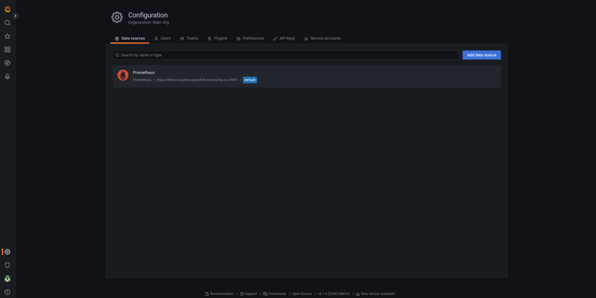

&nbsp;

#### **PostgreSQL datasource setup (Jobs)**

Required for the **AAP - Jobs** dashboard and the **PostgreSQL Accessible** panel on the Health dashboard. Jobs uses SQL queries against the Controller database; Health uses a lightweight `SELECT 1` probe for direct reachability (independent of Controller metrics scrape and Gateway).

The Jobs dashboard uses Grafana datasource **AAP-PostgreSQL** (`uid: aap-postgres`), defined in `common/base/core/grafana-ds-postgres.yaml`. The Kustomize grafana-instance overlays deploy it with the Grafana instance.

| Setting | Default (in-cluster Controller DB) |
|---------|--------------------------------------|
| URL | `aap-postgres-15.aap.svc.cluster.local:5432` |
| Database | `automationcontroller` |
| User / password | From secret `aap-controller-postgres-configuration` keys `username` / `password` |
| SSL | `sslmode: disable` |

Grafana Operator reads that secret from the **same namespace** as the datasource CR (`aap-monitoring`). The Operator creates the secret in the AAP namespace (`aap`); copy it before deploying the Grafana instance (not committed to git):

```shell
oc get secret aap-controller-postgres-configuration -n aap -o yaml \
  | sed 's/namespace: aap/namespace: aap-monitoring/' \
  | oc apply -f -
```

Confirm the datasource is healthy in Grafana (**Connections** → **Data sources** → **AAP-PostgreSQL** → **Save & test**), or:

```shell
oc -n aap-monitoring get grafanadatasource aap-postgres-grafanadatasource
```

If Controller uses an external PostgreSQL (not the in-cluster `aap-postgres-15` Service), follow [External Controller database (Jobs)](#external-controller-database-jobs) before relying on the Jobs dashboard.

&nbsp;

#### **External Controller database (Jobs)**

Applies only when Ansible Automation Platform Controller stores its data in an **external** PostgreSQL (RDS, Azure Database, VM, etc.). Skip this section if you use the default in-cluster Controller Postgres.

The Overview dashboard is unaffected. The **Health** dashboard **PostgreSQL Accessible** panel also uses this datasource (direct `SELECT 1` probe), so it will reflect external DB reachability from Grafana. The **PostgreSQL Health** panel (Controller-observed connections + latency) continues to use Prometheus and is unaffected by datasource URL changes. **AAP - Jobs** talks to the Controller DB directly for job/host drill-down.

1. **Credentials** — Keep (or recreate) a secret named `aap-controller-postgres-configuration` in `aap-monitoring` with at least:

   | Key | Purpose |
   |-----|---------|
   | `username` | DB user Grafana should connect as (read-only recommended) |
   | `password` | DB password |

   You can copy the Operator-managed secret from `aap` (it already points at the external host in its `host` / `database` keys) and then patch only what Grafana needs, or create a dedicated secret with the same keys.

2. **URL** — Patch `spec.datasource.url` in `common/base/core/grafana-ds-postgres.yaml` (or an overlay patch) to the reachable hostname and port, for example:

   ```yaml
   url: my-aap-db.xxxxx.us-east-1.rds.amazonaws.com:5432
   ```

   The Grafana pods in `aap-monitoring` must be able to reach that host (Security Groups, firewall, PrivateLink, Routes, etc.).

3. **Database name** — Keep `automationcontroller` unless your Controller DB name differs; then set both `spec.datasource.database` and `spec.datasource.jsonData.database` accordingly.

4. **TLS** — External DBs usually require SSL. In `spec.datasource.jsonData` set for example:

   ```yaml
   jsonData:
     database: automationcontroller
     sslmode: require   # or verify-full when you mount a CA
     postgresVersion: 1500
   ```

   Change `postgresVersion` to match the server major version (for example `1400` for PostgreSQL 14).

5. **Apply and test**

   ```shell
   oc apply -k overlays/aap-grafana/grafana-instance/   # or overlays/coo/grafana-instance/
   # In Grafana: AAP-PostgreSQL → Save & test → Database Connection OK
   ```

&nbsp;

#### **Creating User in Ansible Automation Platform**

- Access the AAP console and let's create a user for our monitoring.
- To do this, in the left side menu, click on **Users** > **Add**

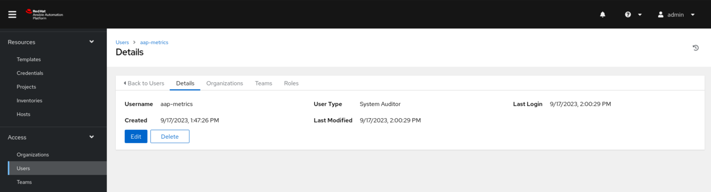


&nbsp;

- To generate the token, authenticate to AAP using the created user and then click on Users > click on the name of the created user > **Token** > **Add**
- Define a **description** and **scope** as **read** and click **Save**, then a popup will be displayed with the token, copy and save.

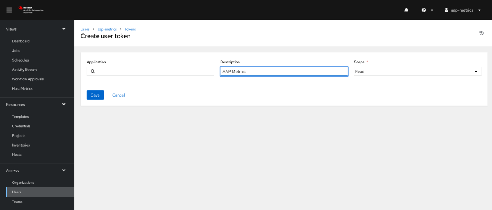

&nbsp;

#### **Creating Prometheus ServiceMonitor**

- Let's create a **ServiceMonitor** to collect metrics from our **AAP** and export through our **Prometheus** and **Thanos Querier**.
- First, let's create a secret to store our bearer token, previously collected in **AAP** with the user **aap-metrics**.

```shell
oc create secret generic aap-monitor-creds --from-literal=token={{ YOUR AAP BEARER TOKEN }} -n aap
```
&nbsp;

- Now let's create **ServiceMonitor**, which will discover the AAP gateway service and collect the metrics that are in the path **/api/controller/v2/metrics/**.

> **Note:** In AAP 2.5+, the metrics endpoint moved from `/api/v2/metrics/` to `/api/controller/v2/metrics/` and authentication goes through the platform gateway.

```shell
cat <<EOF > svc-monitor-aap.yaml
apiVersion: monitoring.coreos.com/v1
kind: ServiceMonitor
metadata:
  name: aap-monitor
  namespace: aap
spec:
  endpoints:
  - interval: 30s
    scrapeTimeout: 10s
    honor_labels: true
    path: /api/controller/v2/metrics/
    port: http
    scheme: http
    bearerTokenSecret:
      key: token
      name: aap-monitor-creds
  namespaceSelector:
    matchNames:
    - aap
  selector:
    matchLabels:
      app.kubernetes.io/component: aap
EOF
```

&nbsp;

- Now let's apply and validate our created ServiceMonitor

```shell
oc create -f svc-monitor-aap.yaml

oc get servicemonitor -n aap
NAME          AGE
aap-monitor   31m
```

&nbsp;

- To validate using the **WebConsole**, in the left side menu, click on **Targets** in the **Observe** Session, in Filter select **User**.

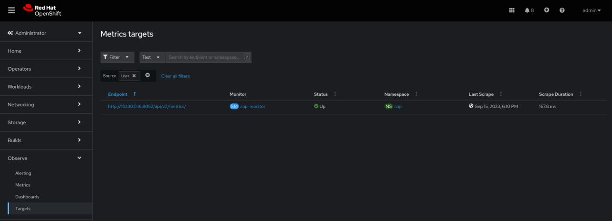

&nbsp;

- Still in the **Observe** section, click on **Metrics**, we will identify whether the AAP metrics are arriving correctly, use any metric starting with **awx_**, for example **awx_instance_info**

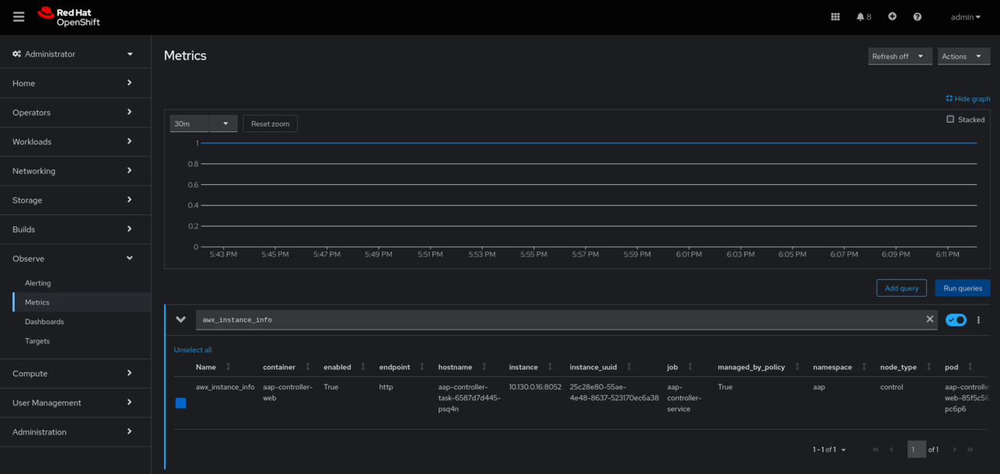

&nbsp;

#### **Creating Grafana Dashboards**

- Now let's apply the AAP Grafana dashboards. Three dashboards are provided:
  - `grafana-aap-overview-dashboard.yaml` — **AAP - Overview** (license, inventory, capacity)
  - `grafana-aap-health-dashboard.yaml` — **AAP - Health & Monitoring** (component health, accessibility, jobs, latency, resource health)
  - `grafana-aap-jobs-dashboard.yaml` — **AAP - Jobs** (PostgreSQL job/host drill-down)

```shell
oc -n aap-monitoring apply -f common/base/dashboards/grafana-aap-overview-dashboard.yaml
oc -n aap-monitoring apply -f common/base/dashboards/grafana-aap-health-dashboard.yaml
oc -n aap-monitoring apply -f common/base/dashboards/grafana-aap-jobs-dashboard.yaml
```

- Validate our created GrafanaDashboards:

```shell
oc -n aap-monitoring get grafanadashboard
NAME                           NO MATCHING INSTANCES   LAST RESYNC   AGE
grafana-dashboard-aap-overview                         3s            145m
grafana-dashboard-aap-health                           3s            1m
grafana-dashboard-aap-jobs                             3s            1m
```

&nbsp;

#### **Viewing the Dashboards**

- Access Grafana, in the left side menu, click on **Dashboards** and then on **Browse**
- A folder with the name **AAP Dashboards** will be displayed, containing three dashboards:
  - **AAP - Overview** — platform configuration, inventory, and capacity
  - **AAP - Health & Monitoring** — real-time health of all AAP components
  - **AAP - Jobs** — filter by organization/project/status, select a job, inspect per-host results and failed messages

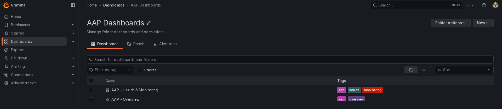

&nbsp;

- **AAP - Overview** Dashboard

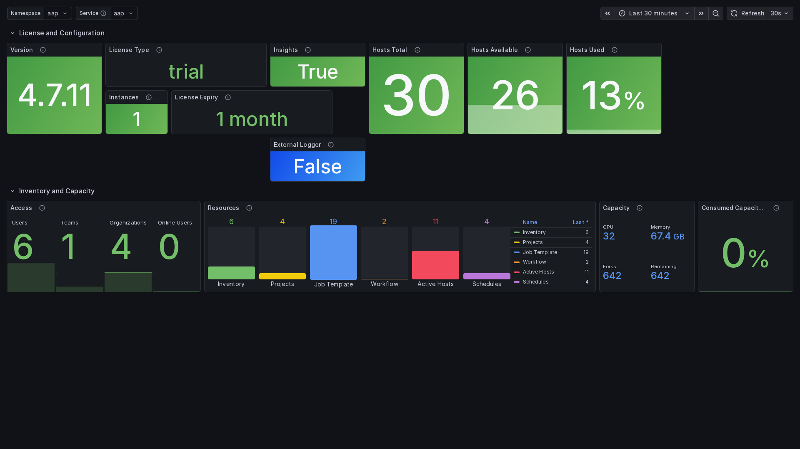

&nbsp;

- **AAP - Health & Monitoring** Dashboard

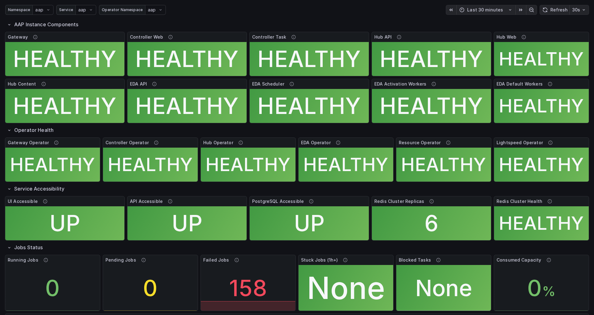
&nbsp;
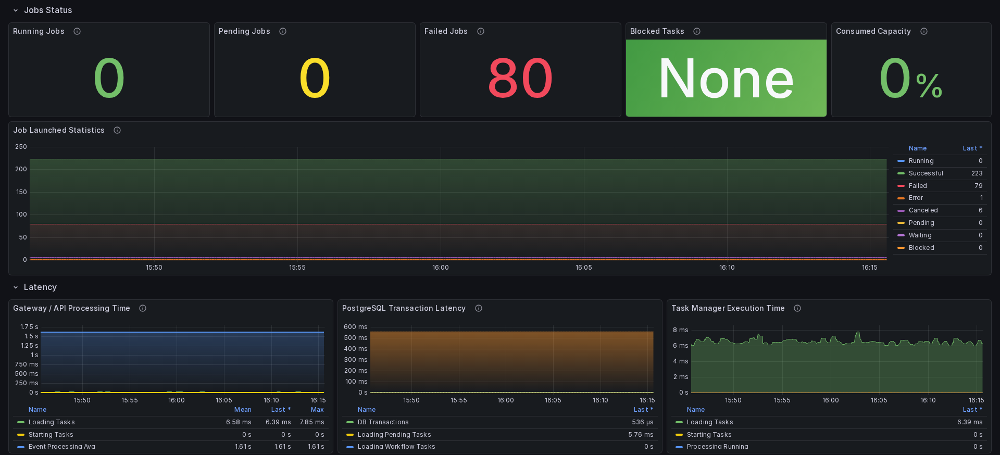
&nbsp;
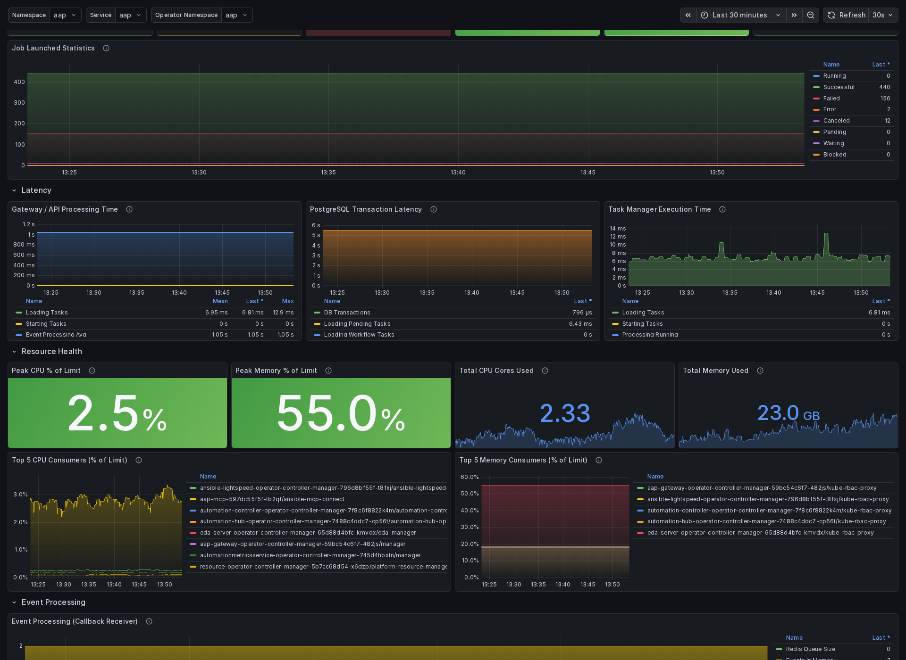

&nbsp;

- **AAP - Jobs** Dashboard

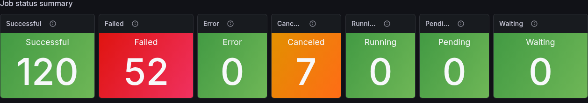

&nbsp;

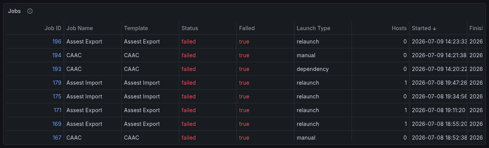

&nbsp;

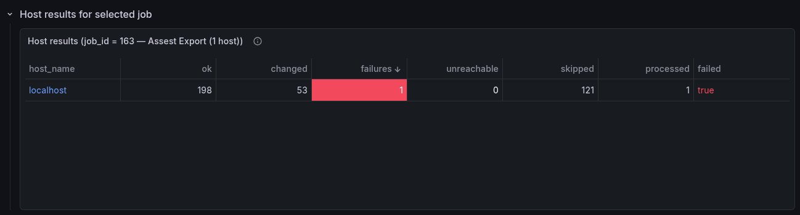

&nbsp;

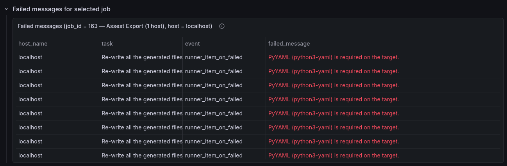

&nbsp;

#### **Kustomize Deployment (UWM)**

If you prefer a GitOps-friendly approach, deploy all UWM resources using the Kustomize overlays. The overlays include all Kubernetes resources described in the manual steps above (RBAC, Grafana instance, datasource, ServiceMonitor, dashboards).

**Prerequisites (not included in the overlays):**

1. Enable user-workload-monitoring ([Enable user-defined projects](#enable-user-defined-projects))
2. Install the Grafana Operator from OperatorHub ([Install Grafana Operator](#install-grafana-operator))
3. Create the AAP bearer token secret in the `aap` namespace ([Creating User in Ansible Automation Platform](#creating-user-in-ansible-automation-platform)):
   ```shell
   oc create secret generic aap-monitor-creds --from-literal=token={{ YOUR AAP BEARER TOKEN }} -n aap
   ```
4. Copy the Controller Postgres configuration secret into `aap-monitoring` (required for the **AAP - Jobs** dashboard):
   ```shell
   oc get secret aap-controller-postgres-configuration -n aap -o yaml \
     | sed 's/namespace: aap/namespace: aap-monitoring/' \
     | oc apply -f -
   ```
5. Update the OAuth proxy image tag in `common/base/core/grafana.yaml` to match your OpenShift version. For example, if you are running OpenShift 4.18, change the image to:
   ```
   registry.redhat.io/openshift4/ose-oauth-proxy-rhel9:v4.18
   ```
   If the Red Hat image is not accessible in your environment, use the upstream image instead:
   ```
   quay.io/openshift/origin-oauth-proxy
   ```
6. Update the session secret in `common/base/core/session-secret.yaml`:
   ```shell
   openssl rand -base64 43 | base64 -w 0
   ```
   Replace the `session_secret` value with the generated output.

**Deploy in this order:**

```shell
# 1. RBAC and namespace
oc apply -k overlays/aap-grafana/infrastructure-rbac/

# 2. Grafana instance, datasources (Prometheus + Postgres), and supporting resources
oc apply -k overlays/aap-grafana/grafana-instance/

# 3. ServiceMonitor for AAP metrics
oc apply -k overlays/aap-grafana/servicemonitor/

# 4. Auth secret and dashboards (Overview + Health + Jobs)
oc apply -k overlays/aap-grafana/dashboards/
```


### **Cluster Observability Operator (COO)**

Deploy a dedicated Prometheus instance via COO when user-workload-monitoring is not available or not desired. Grafana queries the local `prometheus-operated` service; COO Prometheus scrapes AAP metrics, platform kube-state-metrics, and kubelet/cAdvisor for Resource Health panels.

> **Note:** Do **not** enable user-defined projects for this path. Start directly with installing the COO operator below.

&nbsp;

#### **Install Cluster Observability Operator**

- Using the **WebConsole**, in the left side menu, select **OperatorHub** and search for **Cluster Observability Operator**.
- Click on the operator, click **Install**.
- In **Installation Mode**, select **All namespaces on the cluster**.
- In **Update approval**, select **Automatic**.
- Click **Install**.

&nbsp;

- Validate that the operator pod is running:

```shell
oc get pods -n openshift-cluster-observability-operator
```

&nbsp;

#### **COO Prometheus Scrape Permissions**

- Grant the COO Prometheus service account permission to discover nodes, scrape kubelet/cAdvisor, and reach `kube-state-metrics` in `openshift-monitoring`:

```shell
cat <<EOF | oc apply -f -
---
apiVersion: rbac.authorization.k8s.io/v1
kind: ClusterRole
metadata:
  name: aap-coo-prometheus-scrape
rules:
  - apiGroups: [""]
    resources:
      - nodes
      - nodes/metrics
      - services
      - endpoints
      - pods
    verbs: ["get", "list", "watch"]
  - apiGroups: ["networking.k8s.io"]
    resources:
      - ingresses
    verbs: ["get", "list", "watch"]
  - nonResourceURLs: ["/metrics", "/metrics/cadvisor"]
    verbs: ["get"]
---
apiVersion: rbac.authorization.k8s.io/v1
kind: ClusterRoleBinding
metadata:
  name: aap-coo-prometheus-scrape
roleRef:
  apiGroup: rbac.authorization.k8s.io
  kind: ClusterRole
  name: aap-coo-prometheus-scrape
subjects:
  - kind: ServiceAccount
    name: aap-monitoring-stack-prometheus
    namespace: aap-monitoring
EOF
```

> **Note:** The service account name `aap-monitoring-stack-prometheus` is created automatically by COO when the `MonitoringStack` CR is applied. Apply the RBAC binding **before** or **after** the MonitoringStack; COO will bind permissions once the SA exists.

&nbsp;

#### **Creating the MonitoringStack**

- The `MonitoringStack` CR tells COO to provision a Prometheus instance in `aap-monitoring`. The `resourceSelector` discovers any `ServiceMonitor` or `ScrapeConfig` labeled with `monitoredby: aap-monitoring`.
- `spec.resources` sets Prometheus CPU and memory. COO defaults to a 512Mi memory limit, which is often too low once cAdvisor scraping, kube-state-metrics, and AAP ServiceMonitors are enabled — Prometheus can be OOMKilled during WAL replay or compaction. The values below leave CPU at COO defaults and raise memory only.

```shell
cat <<EOF | oc apply -f -
---
apiVersion: monitoring.rhobs/v1alpha1
kind: MonitoringStack
metadata:
  name: aap-monitoring-stack
  namespace: aap-monitoring
  labels:
    app: aap-monitoring
spec:
  alertmanagerConfig:
    disabled: true
  prometheusConfig:
    replicas: 1
    retention: 7d
    retentionSize: 40GB
    scrapeInterval: 30s
    persistentVolumeClaim:
      accessModes:
        - ReadWriteOnce
      resources:
        requests:
          storage: 50Gi
  logLevel: info
  resources:
    requests:
      cpu: 100m
      memory: 2Gi
    limits:
      cpu: 500m
      memory: 4Gi
  namespaceSelector: {}
  resourceSelector:
    matchLabels:
      monitoredby: aap-monitoring
EOF
```

&nbsp;

- Validate that the MonitoringStack and Prometheus pod are ready:

```shell
oc -n aap-monitoring get monitoringstack aap-monitoring-stack
oc -n aap-monitoring get pods -l app.kubernetes.io/managed-by=observability-operator
oc -n aap-monitoring get svc prometheus-operated
```

&nbsp;

#### **Scraping kube-state-metrics (KSM)**

- The health dashboard needs `kube_deployment_*` metrics. Instead of Thanos, the COO Prometheus scrapes the platform `kube-state-metrics` service in `openshift-monitoring` via a cross-namespace `ServiceMonitor` (`monitoring.rhobs/v1`).

```shell
cat <<EOF | oc apply -f -
---
apiVersion: monitoring.rhobs/v1
kind: ServiceMonitor
metadata:
  name: ksm-scrape
  namespace: aap-monitoring
  labels:
    monitoredby: aap-monitoring
spec:
  namespaceSelector:
    matchNames:
      - openshift-monitoring
  selector:
    matchLabels:
      app.kubernetes.io/name: kube-state-metrics
  endpoints:
    - port: https-main
      scheme: https
      tlsConfig:
        caFile: /var/run/secrets/kubernetes.io/serviceaccount/service-ca.crt
        serverName: kube-state-metrics.openshift-monitoring.svc
      bearerTokenFile: /var/run/secrets/kubernetes.io/serviceaccount/token
      honorLabels: true
EOF
```

> **Note:** KSM uses the OpenShift service CA (`service-ca.crt`) with an explicit `serverName`. This is different from kubelet scraping — KSM TLS verification works without `insecureSkipVerify`.

&nbsp;

#### **Scraping kubelet cAdvisor (Resource Health)**

- Resource Health panels need container CPU and memory metrics. A `ScrapeConfig` with Kubernetes Node service discovery scrapes `/metrics/cadvisor` on every node. A `metricRelabelings` keep filter limits storage to only the four metrics the dashboard uses.

```shell
cat <<EOF | oc apply -f -
---
apiVersion: v1
kind: Secret
metadata:
  name: prometheus-sa-token
  namespace: aap-monitoring
  annotations:
    kubernetes.io/service-account.name: aap-monitoring-stack-prometheus
type: kubernetes.io/service-account-token
---
apiVersion: monitoring.rhobs/v1alpha1
kind: ScrapeConfig
metadata:
  name: kubelet-cadvisor
  namespace: aap-monitoring
  labels:
    monitoredby: aap-monitoring
spec:
  scrapeInterval: 30s
  scheme: HTTPS
  metricsPath: /metrics/cadvisor
  honorLabels: true
  authorization:
    credentials:
      name: prometheus-sa-token
      key: token
  tlsConfig:
    insecureSkipVerify: true
  kubernetesSDConfigs:
    - role: Node
  relabelings:
    - sourceLabels: [__address__]
      regex: (.+?)(?::\d+)?
      replacement: ${1}:10250
      targetLabel: __address__
    - sourceLabels: [__meta_kubernetes_node_name]
      targetLabel: node
  metricRelabelings:
    - action: keep
      sourceLabels: [__name__]
      regex: "container_cpu_usage_seconds_total|container_memory_working_set_bytes|container_memory_usage_bytes|container_fs_usage_bytes"
EOF
```

> **TLS note:** The cAdvisor `ScrapeConfig` uses `insecureSkipVerify: true` for kubelet TLS. The kubelet-serving CA is managed by the Cluster Monitoring Operator and rotates frequently; no auto-injection mechanism exists to sync it to other namespaces. Bearer token authentication still verifies the Prometheus SA identity. This is internal cluster traffic only.

&nbsp;

- Verify scrape targets after COO Prometheus has reconciled (allow 1–2 minutes):

```shell
oc -n aap-monitoring port-forward svc/prometheus-operated 9090:9090 &
curl -s http://localhost:9090/api/v1/targets | python3 -m json.tool | grep -E '"job"|"health"'
```

&nbsp;

#### **Creating Grafana Datasource (COO)**

- Create the **GrafanaDatasource** pointing at the COO Prometheus service. No bearer token or TLS skip is needed — Grafana and Prometheus run in the same namespace:

```shell
cat <<EOF | oc apply -f -
apiVersion: grafana.integreatly.org/v1beta1
kind: GrafanaDatasource
metadata:
  name: grafana-ds
  namespace: aap-monitoring
spec:
  instanceSelector:
    matchLabels:
      dashboards: "grafana"
  datasource:
    name: Prometheus
    type: prometheus
    access: proxy
    url: http://prometheus-operated.aap-monitoring.svc.cluster.local:9090
    isDefault: true
    jsonData:
      timeInterval: "5s"
    editable: true
EOF
```

&nbsp;

- Validate the Grafana instance and datasource:

```shell
oc -n aap-monitoring get pods -l app=grafana
oc -n aap-monitoring get grafanadatasource
oc -n aap-monitoring get route grafana-route -o jsonpath='{.spec.host}'
```

&nbsp;

#### **Creating Prometheus ServiceMonitor (COO)**

- Create the AAP metrics user and bearer token secret the same way as in [Creating User in Ansible Automation Platform](#creating-user-in-ansible-automation-platform).

```shell
oc create secret generic aap-monitor-creds --from-literal=token={{ YOUR AAP BEARER TOKEN }} -n aap
```

&nbsp;

- Create the AAP `ServiceMonitor` using the COO API (`monitoring.rhobs/v1`) and label it so the MonitoringStack discovers it:

```shell
cat <<EOF | oc apply -f -
---
apiVersion: monitoring.rhobs/v1
kind: ServiceMonitor
metadata:
  name: aap-monitor
  namespace: aap
  labels:
    monitoredby: aap-monitoring
spec:
  endpoints:
  - interval: 30s
    scrapeTimeout: 10s
    honor_labels: true
    path: /api/controller/v2/metrics/
    port: http
    scheme: http
    bearerTokenSecret:
      key: token
      name: aap-monitor-creds
  namespaceSelector:
    matchNames:
    - aap
  selector:
    matchLabels:
      app.kubernetes.io/component: aap
EOF
```

&nbsp;

- Validate the ServiceMonitor and confirm AAP targets appear in COO Prometheus:

```shell
oc get servicemonitor -n aap
oc -n aap-monitoring port-forward svc/prometheus-operated 9090:9090 &
curl -s http://localhost:9090/api/v1/targets | python3 -m json.tool | grep -A2 'aap'
```

&nbsp;

#### **Creating Grafana Dashboards (COO)**

- Apply the same dashboard manifests as the UWM path (including **AAP - Jobs**):

```shell
oc -n aap-monitoring apply -f common/base/dashboards/grafana-aap-overview-dashboard.yaml
oc -n aap-monitoring apply -f common/base/dashboards/grafana-aap-health-dashboard.yaml
oc -n aap-monitoring apply -f common/base/dashboards/grafana-aap-jobs-dashboard.yaml
```

&nbsp;

- Validate:

```shell
oc -n aap-monitoring get grafanadashboard
```

&nbsp;

#### **Viewing the Dashboards (COO)**

- Access Grafana via the route URL, authenticate with OpenShift credentials, and open **Dashboards** > **Browse** > **AAP Dashboards**.
- The **AAP - Overview**, **AAP - Health & Monitoring**, and **AAP - Jobs** dashboards are the same as in the UWM path (see [Viewing the Dashboards](#viewing-the-dashboards) and [AAP - Jobs](#aap---jobs)). Resource Health panels populate once cAdvisor scraping is active.
- Jobs dashboard Postgres setup is shared with UWM: [PostgreSQL datasource setup (Jobs)](#postgresql-datasource-setup-jobs) and, if needed, [External Controller database (Jobs)](#external-controller-database-jobs).

&nbsp;

#### **Kustomize Deployment (COO)**

If you prefer a GitOps-friendly approach, deploy all COO resources using the Kustomize overlays. The overlays include all Kubernetes resources described in the manual steps above (RBAC, COO scrape permissions, MonitoringStack, KSM ServiceMonitor, cAdvisor ScrapeConfig, Grafana instance, datasource, AAP ServiceMonitor, dashboards).

**Prerequisites (not included in the overlays):**

1. Install the Cluster Observability Operator from OperatorHub ([Install Cluster Observability Operator](#install-cluster-observability-operator))
2. Install the Grafana Operator from OperatorHub ([Install Grafana Operator](#install-grafana-operator))
3. Create the AAP bearer token secret in the `aap` namespace ([Creating User in Ansible Automation Platform](#creating-user-in-ansible-automation-platform)):
   ```shell
   oc create secret generic aap-monitor-creds --from-literal=token={{ YOUR AAP BEARER TOKEN }} -n aap
   ```
4. Copy the Controller Postgres configuration secret into `aap-monitoring` (required for the **AAP - Jobs** dashboard):
   ```shell
   oc get secret aap-controller-postgres-configuration -n aap -o yaml \
     | sed 's/namespace: aap/namespace: aap-monitoring/' \
     | oc apply -f -
   ```
5. Update the OAuth proxy image tag in `common/base/core/grafana.yaml` to match your OpenShift version. For example, if you are running OpenShift 4.18, change the image to:
   ```
   registry.redhat.io/openshift4/ose-oauth-proxy-rhel9:v4.18
   ```
   If the Red Hat image is not accessible in your environment, use the upstream image instead:
   ```
   quay.io/openshift/origin-oauth-proxy
   ```
6. Update the session secret in `common/base/core/session-secret.yaml`:
   ```shell
   openssl rand -base64 43 | base64 -w 0
   ```
   Replace the `session_secret` value with the generated output.

**Deploy in this order:**

```shell
# 1. RBAC and namespace (Grafana OAuth RBAC + COO Prometheus scrape permissions; no cluster-monitoring-view)
oc apply -k overlays/coo/infrastructure-rbac/

# 2. MonitoringStack CR + KSM ServiceMonitor + cAdvisor ScrapeConfig
oc apply -k overlays/coo/monitoring-stack/

# 3. Grafana instance and datasources (Prometheus patched to prometheus-operated; Postgres for Jobs)
oc apply -k overlays/coo/grafana-instance/

# 4. AAP ServiceMonitor (monitoring.rhobs/v1 + monitoredby label)
oc apply -k overlays/coo/servicemonitor/

# 5. Auth secret and dashboards (Overview + Health + Jobs)
oc apply -k overlays/coo/dashboards/
```


## **Containerized Deployment (RHEL)**

This section covers monitoring AAP 2.5/2.6 running as a **containerized deployment on RHEL** (podman). Unlike the OpenShift paths above, there is no Kubernetes, so `kube_deployment_*`, `kube_statefulset_*`, and `container_*` metrics are not available. Instead, use the standalone **AAP - Health & Monitoring (Containerized)** dashboard, which combines Prometheus `awx_*` / controller metrics from `/api/controller/v2/metrics/` with Grafana Infinity queries against `/api/gateway/v1/status/`.

### Monitoring Scope & Limitations

| Target | Covered? | How |
|--------|----------|-----|
| **Gateway** | Yes | Infinity → `/api/gateway/v1/status/` (`services.gateway.status`); Prometheus `up` also indicates scrape reachability |
| **Controller** | Yes | Infinity status + full `awx_*` / `task_manager_*` / `callback_receiver_*` metrics |
| **Execution / Hop nodes** | Yes | Registered mesh nodes via `awx_instance_info` / capacity with `node_type` |
| **Hub** | Yes | Infinity → `/api/gateway/v1/status/` (`services.hub.status`); N/A if Hub is not installed |
| **EDA** | Yes | Infinity → `/api/gateway/v1/status/` (`services.eda.status`); N/A if EDA is not installed |
| **Redis** | Yes | Infinity status + mode (`services.redis.status` / `services.redis.mode`); Prometheus queue depth via `callback_receiver_events_queue_size_redis` |
| **PostgreSQL** | Partial | Controller-observed connections + latency (`awx_database_connections_total`, commit/event processing gauges). Not an independent Grafana `SELECT 1` probe. |

Requires the **Grafana Infinity** datasource plugin (`yesoreyeram-infinity-datasource`). No blackbox_exporter or json_exporter is required.

Verify the Gateway status API outside Grafana if needed:

```bash
curl -k -H "Authorization: Bearer <token>" \
  https://<gateway_host>/api/gateway/v1/status/
```

This returns JSON including Gateway, Controller, Hub, EDA, and Redis (`mode`, `status`, `ping`). The dashboard Component Status row queries the same endpoint via Infinity.

### Prerequisites (Containerized)

- A running AAP 2.5/2.6 containerized installation on RHEL
- Prometheus installed on a host that can reach the AAP Gateway (standalone or containerized)
- Grafana installed with:
  - a Prometheus datasource connected to that Prometheus instance
  - the **Infinity** datasource plugin installed and configured against the AAP Gateway (`/api/gateway/v1/status/`) with a Bearer token
- An OAuth2 / personal access token from AAP (read scope) for Prometheus scrape auth and Infinity Gateway API auth

### Prometheus Setup

**1. Create an OAuth2 token in AAP**

Create a personal access token (PAT) for a user with at least `System Auditor` role in the AAP Controller. Go to **Users → <user> → Tokens → Create Token**, select scope `read`, and copy the token value.

Alternatively, use the API:

```bash
curl -k -X POST https://<gateway_host>/api/controller/v2/tokens/ \
  -H "Content-Type: application/json" \
  -u <admin_user>:<password> \
  -d '{"scope": "read"}'
```

**2. Configure Prometheus scrape**

Add the following job to your `prometheus.yml`:

```yaml
scrape_configs:
  - job_name: 'controller'
    tls_config:
      insecure_skip_verify: true    # if using self-signed certs
    metrics_path: /api/controller/v2/metrics/
    scrape_interval: 5s
    scheme: https
    bearer_token: <token_value>
    static_configs:
      - targets:
          - <gateway_host>
```

Replace `<token_value>` with the PAT from step 1, and `<gateway_host>` with the hostname or IP of the AAP Gateway. If the Gateway uses a non-default port, include it (e.g., `gateway.example.com:8443`).

**3. Verify metrics**

After restarting Prometheus, verify the target is `UP` in the Prometheus UI under **Status → Targets**. You should see the `controller` job with a green `UP` status.

Test a query in the Prometheus expression browser:

```promql
awx_instance_info
```

This should return one time series per controller instance with labels like `hostname`, `version`, and `node_type`.

### Grafana Setup and Dashboard Import

**1. Add the Prometheus datasource in Grafana**

In Grafana, go to **Configuration → Data Sources → Add data source → Prometheus** and enter the Prometheus server URL (e.g., `http://prometheus-host:9090`).

**2. Add the Infinity datasource in Grafana**

Install the **Infinity** plugin (`yesoreyeram-infinity-datasource`) if it is not already available, then add a datasource:

- **URL**: `https://<gateway_host>` (include port if non-default, e.g. `:8443`)
- **Auth**: Bearer token (same read-scoped AAP token used for Prometheus, or a dedicated token)
- **TLS**: allow insecure / skip verify only if using self-signed certs

The Component Status panels query the relative path `/api/gateway/v1/status/` against this base URL.

**3. Import the containerized Health dashboard**

The dashboard file is located at:

```
common/base/dashboards/grafana-aap-health-containerized-dashboard.json
```

In Grafana, go to **Dashboards → Import → Upload JSON file** and select the file above. When prompted:

- select the **Prometheus** datasource for `$datasource`
- select the **Infinity** datasource for `$status_datasource`

The dashboard will appear under its default title **AAP - Health & Monitoring (Containerized)**.

**3. Template variables**

The dashboard provides three template variables at the top:

| Variable | Purpose |
|----------|---------|
| **Data Source** | Selects which Prometheus datasource to query |
| **Service** | Filters by the Prometheus `job` label (matches `job_name` from scrape config) |
| **Instance** | Filters by the Prometheus `instance` label (the `host:port` of the scrape target) |


## **Conclusion**

This repository provides monitoring for Ansible Automation Platform across three deployment models: **User-Workload Monitoring** and **Cluster Observability Operator** for OpenShift, and a **Containerized (RHEL)** path for podman-based installations. The OpenShift paths deliver the full Grafana dashboard suite — **Overview**, **Health & Monitoring**, and **Jobs** — covering component health, service accessibility, job status, latency, resource consumption, and per-job / per-host drill-down against the Controller PostgreSQL database. The containerized path provides a standalone **Health & Monitoring (Containerized)** dashboard using Prometheus `awx_*` / controller metrics from `/api/controller/v2/metrics/` plus Grafana Infinity against `/api/gateway/v1/status/` for Gateway, Controller, Hub, EDA, and Redis status/mode.
