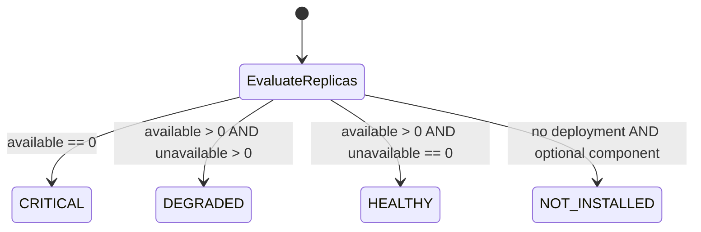
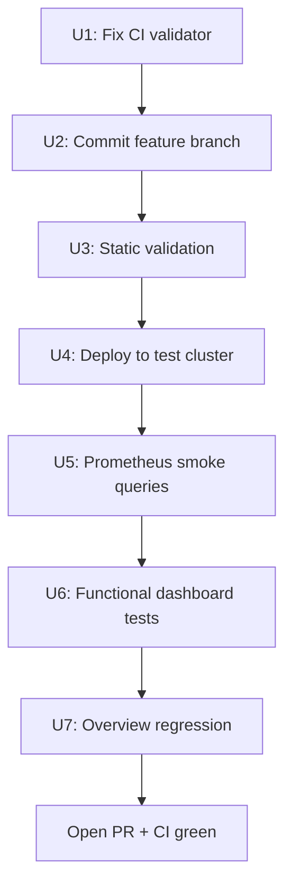

# feat: AAP Health Dashboard 2.5/2.6 Compatibility — Test & Ship Plan

**Status:** active  
**Date:** 2026-06-15  
**Branch:** `feature/dashboard-25-26-compat`  
**Depth:** Standard

---

## Summary

Validate, fix CI gaps, commit, and ship the uncommitted Health dashboard changes that add three-state component health (`HEALTHY` / `DEGRADED` / `CRITICAL`) and gray `NOT INSTALLED` handling for optional AAP 2.5/2.6 components. The work is functionally complete locally but not yet committed; CI will fail until the dashboard JSON validation step is updated.

---

## Problem Frame

The `feature/dashboard-25-26-compat` branch targets AAP 2.5 and 2.6 environments where binary healthy/critical panels produced false alarms during rollouts and for optional components (EDA, MCP, Hub Redis, Lightspeed, Metrics). The health dashboard was rewritten with richer PromQL and panel mappings, and `README.md` was updated to document panel states.

Current state:

- Branch tip equals `main` (`08b27d5`); all feature work is **uncommitted**
- Local YAML and Kustomize builds pass
- Embedded JSON parses correctly when loaded via PyYAML (`49` panels)
- `.github/workflows/validate.yml` fails because it only recognizes `json: |` blocks; the health dashboard now uses an escaped `json: "..."` string

---

## Requirements

| ID | Requirement |
|----|-------------|
| R1 | Health dashboard JSON is valid and deployable via Grafana Operator `GrafanaDashboard` CR |
| R2 | Component panels show `HEALTHY`, `DEGRADED`, or `CRITICAL` based on replica availability during rollouts |
| R3 | Optional components show gray `NOT INSTALLED` when absent, not red `CRITICAL` |
| R4 | Overview dashboard remains unchanged and regression-free |
| R5 | CI `Validate` workflow passes on the feature branch PR |
| R6 | Functional validation passes on at least one AAP 2.5+ cluster; AAP 2.6 if available |
| R7 | `README.md` panel-state documentation matches live dashboard behavior |

---

## Key Technical Decisions

| ID | Decision | Rationale |
|----|----------|-----------|
| KTD1 | Update `validate.yml` to parse `spec.json` from loaded YAML instead of scanning for `json: \|` | Health dashboard format changed; overview still uses `json: \|`. YAML-load approach works for both. |
| KTD2 | Keep escaped-string JSON format for health dashboard (do not reformat to `json: \|`) | Already valid, parses, and Kustomize builds succeed. Reformatting ~200 KB JSON adds diff noise without functional benefit. |
| KTD3 | Commit feature work before opening PR or running cluster tests | Branch has zero commits ahead of `main`; tests must target a committed revision for traceability. |
| KTD4 | Use Kustomize overlays for cluster deployment tests | Matches README and repo conventions; validates end-to-end manifest wiring. |

---

## High-Level Technical Design

### Health panel state model



Core PromQL pattern for required components:

```
(available > bool 0) + (unavailable == bool 0)
```

- `0` → CRITICAL (red)
- `1` → DEGRADED (yellow)
- `2` → HEALTHY (green)

Optional components add `noValue: "NOT INSTALLED"` and a null-mapping to gray (`#B0BEC5`).

### Test execution flow



---

## Scope Boundaries

**In scope**

- `common/base/dashboards/grafana-aap-health-dashboard.yaml`
- `README.md` (panel-state docs)
- `.github/workflows/validate.yml` (JSON validation fix)

**Out of scope**

- Overview dashboard changes
- Grafana instance, ServiceMonitor, RBAC manifest changes
- New automated Playwright/e2e test framework (repo has none today)

### Deferred to Follow-Up Work

- Add a reusable local `scripts/validate.sh` mirroring CI (nice-to-have, not blocking)
- Grafana screenshot regression tests for dashboard layout
- Automated PromQL query validation against a live Prometheus (requires cluster fixture)

---

## Risks & Dependencies

| Risk | Mitigation |
|------|------------|
| CI fails on PR | Fix validator in U1 before opening PR |
| Uncommitted work lost | Commit in U2 before cluster testing |
| AAP 2.6 deployment name regex mismatch | Run version matrix in U6; adjust regexes if panels show N/A |
| PostgreSQL panel lag (60s scrape interval) | Document expected delay in test notes; wait before asserting DOWN |
| No test cluster available | Static validation + JSON parse still ship-ready; cluster tests become manual follow-up |

**Dependencies:** OpenShift 4.16+, user-workload monitoring, Grafana Operator v5.21+, AAP 2.5+ deployed, monitoring user token, `oc` CLI access.

---

## Implementation Units

### U1. Fix CI embedded JSON validation

**Goal:** Make `Validate` workflow accept both `json: |` and `json: "..."` dashboard formats.

**Requirements:** R5

**Files:**

- `.github/workflows/validate.yml`

**Approach:** Replace the line-scanner that searches for `json: |` with logic that:

1. Loads each dashboard YAML with PyYAML
2. Reads `doc["spec"]["json"]`
3. Calls `json.loads()` on the string value

Mirror the same logic in any local validation script if added later.

**Test scenarios:**

- Health dashboard YAML (escaped string format) passes JSON validation
- Overview dashboard YAML (`json: |` format) still passes
- Malformed JSON in either file causes workflow failure with clear error message
- Missing `spec.json` causes failure with dashboard filename in error

**Verification:** Run the updated validation step locally; both dashboard files print `validated`.

---

### U2. Commit and push feature branch

**Goal:** Record the dashboard and README changes on `feature/dashboard-25-26-compat`.

**Requirements:** R1, R7

**Dependencies:** U1 (recommended — commit CI fix together or immediately after)

**Files:**

- `common/base/dashboards/grafana-aap-health-dashboard.yaml`
- `README.md`
- `.github/workflows/validate.yml` (if fixed in U1)

**Approach:** Single focused commit describing 2.5/2.6 compatibility: three-state health, NOT INSTALLED for optional components, README panel-state table. Push branch to `origin`.

**Test scenarios:**

- `git log main..HEAD` shows at least one commit
- `git diff main...HEAD --stat` lists only expected files
- Working tree clean after commit

**Verification:** Branch pushed; PR can be opened against `main`.

---

### U3. Static validation (local + CI)

**Goal:** Confirm all manifests are syntactically valid and Kustomize overlays build.

**Requirements:** R5

**Dependencies:** U2

**Files:** (read-only validation across repo)

- `common/**`
- `overlays/**`
- `.github/workflows/validate.yml`

**Approach:** Reproduce all three CI job steps locally, then trigger GitHub Actions via PR or `workflow_dispatch`.

**Test scenarios:**

- Every `.yaml`/`.yml` under `common`, `overlays`, `.github/workflows` parses with `yaml.safe_load_all`
- `kustomize build` succeeds for all four overlays: `infrastructure-rbac`, `grafana-instance`, `servicemonitor`, `dashboards`
- Both dashboard JSON blobs parse; health dashboard reports title `AAP - Health & Monitoring` and 49 panels

**Verification:** Local commands exit 0; GitHub Actions `Validate` job green.

---

### U4. Deploy monitoring stack to test cluster

**Goal:** Apply Kustomize overlays and confirm Grafana Operator reconciles dashboards.

**Requirements:** R1, R4

**Dependencies:** U3, cluster prerequisites met

**Files:** (applied via overlays, not edited)

- `overlays/aap-grafana/infrastructure-rbac`
- `overlays/aap-grafana/grafana-instance`
- `overlays/aap-grafana/servicemonitor` (into AAP namespace)
- `overlays/aap-grafana/dashboards`

**Approach:** Follow README Kustomize deployment section. Set AAP namespace for ServiceMonitor overlay.

**Test scenarios:**

- `GrafanaDashboard` resources `grafana-dashboard-aap-overview` and `grafana-dashboard-aap-health` reach Ready
- Grafana route accessible; datasource points to Thanos querier
- ServiceMonitor target `up == 1` for AAP metrics job

**Verification:** `oc -n aap-monitoring get grafanadashboard` shows both dashboards; no error conditions on health dashboard CR.

---

### U5. Prometheus datasource smoke queries

**Goal:** Confirm metrics required by new panel expressions exist before UI testing.

**Requirements:** R2, R3, R6

**Dependencies:** U4

**Approach:** Run queries in Grafana Explore against the Prometheus datasource.

**Test scenarios:**

| Query | Expected |
|-------|----------|
| `kube_deployment_status_replicas_available{namespace="<aap-ns>"}` | Series for gateway, controller, hub deployments |
| `kube_deployment_status_replicas_unavailable{namespace="<aap-ns>"}` | Series present (may be 0) |
| `up{namespace="<aap-ns>"}` | `1` for AAP scrape job |
| `awx_running_jobs_total{namespace="<aap-ns>"}` | Numeric value |
| `kube_deployment_status_replicas{deployment=~".*-gateway-operator-.*"}` | Data if operators monitored |

**Verification:** All queries return data (or documented N/A for optional components). Dashboard template variables `$namespace`, `$service`, `$operator_namespace` populate.

---

### U6. Functional Health dashboard validation

**Goal:** Prove three-state and NOT INSTALLED behavior matches R2 and R3 on a live cluster.

**Requirements:** R2, R3, R6, R7

**Dependencies:** U5

**Approach:** Manual scenario testing in Grafana UI. Record results in PR test plan.

#### AAP Instance Components

| Scenario | Simulation | Expected |
|----------|------------|----------|
| Healthy | Normal operation | Green HEALTHY on Gateway, Controller Web/Task, Hub API |
| Degraded | Scale deployment to 2+, delete one pod mid-rollout | Yellow DEGRADED |
| Critical | Scale gateway or controller to 0 | Red CRITICAL |
| Not installed | EDA/MCP not deployed | Gray NOT INSTALLED |

#### Operator Health

- Installed operators → green when healthy
- Absent operators (Lightspeed, Metrics) → gray NOT INSTALLED

#### Service Accessibility

- UI, API, PostgreSQL panels show UP under normal conditions
- Redis replica count matches cluster size (typically 6)
- Optional failure injection: break DB connectivity → PostgreSQL DOWN within ~60s

#### Jobs, Latency, Resource Health, Event Processing

- Job panels respond to launched/failed jobs
- Job Launched Statistics shows deduplicated series (no multi-replica spike artifacts)
- Latency graphs render under load
- Peak CPU/Memory % between 0–100; Top 5 bar gauges show pod names
- Event Processing shows data when jobs run; idle state acceptable

**AAP version matrix (when both available):**

| Check | AAP 2.5 | AAP 2.6 |
|-------|---------|---------|
| Deployment regexes match pod names | Pass | Pass |
| Optional components gray when absent | Pass | Pass |
| Required components three-state logic | Pass | Pass |

**Verification:** Test checklist in PR description completed; screenshots optional for degraded/critical states.

---

### U7. Overview dashboard regression

**Goal:** Confirm unchanged overview dashboard still works after health dashboard deploy.

**Requirements:** R4

**Dependencies:** U4

**Files:**

- `common/base/dashboards/grafana-aap-overview-dashboard.yaml` (read-only check)

**Test scenarios:**

- Overview dashboard loads in Grafana
- License & Configuration, Inventory, Resources panels show data
- No new errors in `GrafanaDashboard` status for overview CR

**Verification:** Quick smoke pass documented in PR test plan.

---

## Acceptance Checklist (PR Test Plan)

Copy into PR description when opening the pull request:

- [ ] U1: CI validator accepts both JSON formats
- [ ] U2: Feature committed and pushed
- [ ] U3: Static validation green (local + GitHub Actions)
- [ ] U4: Both GrafanaDashboard CRs Ready on test cluster
- [ ] U5: Prometheus smoke queries return data
- [ ] U6: Three-state health verified with rollout simulation
- [ ] U6: Optional components show NOT INSTALLED (not false alarm)
- [ ] U6: Service accessibility panels respond correctly
- [ ] U6: Jobs panels react to real job activity
- [ ] U6: Tested on AAP 2.5 and/or 2.6
- [ ] U7: Overview dashboard regression pass
- [ ] R7: README panel-state table matches observed colors/labels

---

## Open Questions

| Question | Status | Resolution path |
|----------|--------|-----------------|
| Is an AAP 2.6 test cluster available? | Open | If no, ship with 2.5 validation and note in PR |
| Commit CI fix in same PR or separate commit? | Resolved → KTD3/KTD1 | Same PR, U1 before or with U2 |
